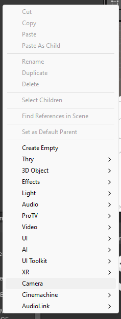
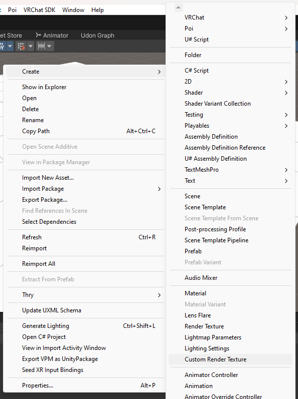

# F1dg3t-s-Render-Textures-Demo
A demo of render Textures in VRChat.

#How to use:
1. Create a camera and put it where you want.

2. Create a new render texture to store the camera view.

3. Edit settings on your render texture if you want a higher resolution or different color output.

4. Assign the new render texture to the "Target Texture" box on the camera.

5. Create a new material to put the texture on.

6. Put that material on your object, test it, and edit the settings as needed.
